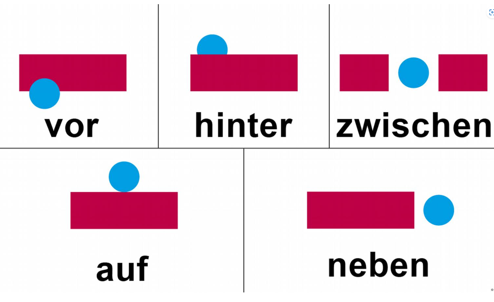
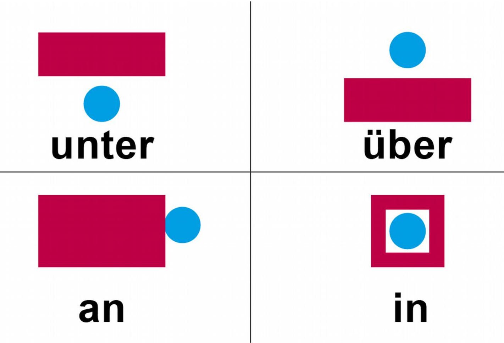
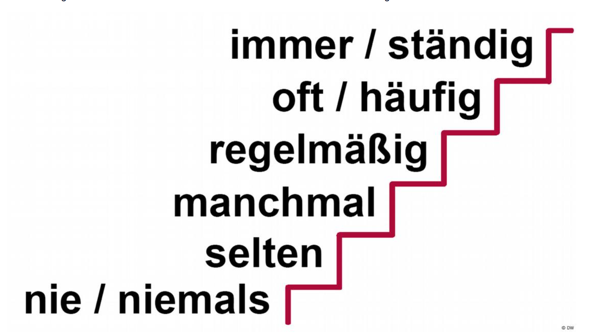

## 1 Meeting people

| German | English |
| ------ | ------- |
| wer    | who     |
| was    | what    |
| warum  | why     |
| wie    | how     |
| welche | which   |
| wo     | where   |
| wann   | when    |

---

Wie heißen Sie?– Ich heiße Emma.

Wie ist Ihr Name? – Mein Name ist Lisa.

Wie heißt du? – Ich heiße Lisa.

Wer bist du? – Ich bin Lisa.

Wer sind Sie? - Ich bin Lisa.

Wer ist das? – Das ist Emma.

---

Wie schreibt man das? (How do you write that?)

---

Nicos Tasche ist weg. (Nicos bag is gone.)

---

| ich   | du     | er/sie/es | Sie    |                                                                                              |
| ----- | ------ | --------- | ------ | -------------------------------------------------------------------------------------------- |
| komme | kommst | kommt     | kommen | Most verbs are conjugated in the present tense as this                                       |
| wohne | wohnst | wohnt     | wohnen |                                                                                              |
| lerne | lernst | lernt     | lernen |                                                                                              |
| mache | machst | macht     | machen |                                                                                              |
| heiße | heißt  | heißt     | heißen | When the verb stem ends in -s, -ß, -z or -x , the second-person singular form only adds a -t |
| bin   | bist   | ist       | sind   | irregular                                                                                    |

---

Plural:

1st person, wir heißen

2nd person, ihr heißt

3rd person, sie heißen

---

Conjugation of the verb haben

present tense:
| Person     | Singular      | Plural    | Formal    |
| ---------- | ------------- | --------- | --------- |
| 1st person | ich habe      | wir haben |           |
| 2nd person | du hast       | ihr habt  | Sie haben |
| 3rd person | er/sie/es hat | sie haben |           |
| ---------- | ------------- | --------- | --------- |
| 1st person | ich hatte      | wir hatten |           |
| 2nd person | du hattest       | ihr hattet  | Sie hatten |
| 3rd person | er/sie/es hatte | sie hatten |           |
| Formal     |               |           | Sie hatten |

---

Woher kommst du?
 – Ich komme aus Deutschland
---

Conjugation of the verb kommen

|            | Singular        | Plural     | Formal (singular und plural) |
| ---------- | --------------- | ---------- | ---------------------------- |
| 1st person | ich komme       | wir kommen |                              |
| 2nd person | du kommst       | ihr kommt  |                              |
| 3rd person | er/sie/es kommt | sie kommen | Sie kommen                   |

---

Conjugation of the verb arbeiten

|            | Singular           | Plural       | Formal (singular und plural) |
| ---------- | ------------------ | ------------ | ---------------------------- |
| 1st person | ich arbeite        | wir arbeiten |                              |
| 2nd person | du arbeitest       | ihr arbeitet |                              |
| 3rd person | er/sie/es arbeitet | sie arbeiten | Sie arbeiten                 |

---

Vocabulary:

1. https://learngerman.dw.com/en/ich-hei%C3%9Fe-emma/l-37262882/lv
2. https://learngerman.dw.com/en/das-ist-nico/l-37262923/lv
3. https://learngerman.dw.com/en/woher-kommst-du/l-37263828/lv
4. https://learngerman.dw.com/en/nico-hat-ein-problem/l-37265543/lv

Grammer:

[Conjugation: present tense (1)](https://learngerman.dw.com/en/conjugation-present-tense-1/l-37263828/gr-38320838)

[Conjugation: present tense (2)](https://learngerman.dw.com/en/conjugation-present-tense-2/l-37265543/gr-38321810)

[Conjugation: haben](https://learngerman.dw.com/en/conjugation-haben/l-37265543/gr-38310825)

---

## 2 Contact details

1-20:

| Number | Breakdown     | German       |
| ------ | ------------- | ------------ |
| 1      | -             | eins         |
| 2      | -             | zwei         |
| 3      | -             | drei         |
| 4      | -             | vier         |
| 5      | -             | fünf         |
| 6      | -             | sechs        |
| 7      | -             | sieben       |
| 8      | -             | acht         |
| 9      | -             | neun         |
| 10     | -             | zehn         |
| 11     | -             | elf          |
| 12     | -             | zwölf        |
| 13     | drei + zehn   | dreizehn     |
| 14     | vier + zehn   | vierzehn     |
| 15     | fünf + zehn   | fünfzehn     |
| 16     | sechs + zehn  | **sechzehn** |
| 17     | sieben + zehn | **siebzehn** |
| 18     | acht + zehn   | achtzehn     |
| 19     | neun + zehn   | neunzehn     |
| 20     | -             | zwanzig      |

21-99 的组合规则,
德语数字的“反序”组合是重点！记住公式：个位 + und + 十位:

- 21 = **ein**undzwanzig（字面：1 和 20）
- 34 = vierunddreißig（4 和 30）
- 67 = siebenundsechzig（7 和 60）

十位数的规律：

- 10: **zehn**
- 20: **zwanzig**
- 30: **dreißig**
- 40: vierzig
- 50: fünfzig
- 60: **sechzig**
- 70: **siebzig**
- 80: achtzig
- 90: neunzig

三位数及以上:

- 100 = (ein)hundert（“ein”可以省略）
- 200 = zweihundert
- 365 = dreihundertfünfundsechzig（300 + 65）
- 1000 = (ein)tausend
- 2024 = zweitausendvierundzwanzig

---

Vocabulary:

1. https://learngerman.dw.com/en/zahlen-von-1-bis-100/l-37265621/lv
2. https://learngerman.dw.com/en/wichtige-nummern/l-37269501/lv
3. http://learngerman.dw.com/en/adressen/l-37269671/lv
4. https://learngerman.dw.com/en/auf-dem-amt/l-37269629/lv

---

## 3 In company

The three articles(3 个冠词):

der(Masculine) Wein/Saft/Kaffee/Tee
die(feminine) Milch/Cola
das(neuter) Wasser/Bier

---

Vowel change: e to i

| Person       | Singular       | Plural    |
| ------------ | -------------- | --------- |
| 1st person   | ich esse       | wir essen |
| 2nd person   | du isst        | ihr esst  |
| 3rd person   | er/sie/es isst | sie essen |
| Formal (S/P) | Sie essen      | Sie essen |

| Person       | Singular        | Plural     |
| ------------ | --------------  | ---------- |
| 1st person   | ich nehme       | wir nehmen |
| 2nd person   | du nimmst       | ihr nehmt  |
| 3rd person   | er/sie/es nimmt | sie nehmen |
| Formal (S/P) | Sie nehmen      | Sie nehmen |

| Person       | Singular          | Plural       |
| ------------ | ----------------- | ------------ |
| 1st person   | ich spreche       | wir sprechen |
| 2nd person   | du sprichst       | ihr sprecht  |
| 3rd person   | er/sie/es spricht | sie sprechen |
| Formal (S/P) | Sie sprechen      | Sie sprechen |

---

How much is it?

- Wie viel kostet das?
- Was kostet das?

---

Vocabulary:

1. https://learngerman.dw.com/en/was-machst-du-hier/l-37278679/lv
2. https://learngerman.dw.com/en/was-trinkst-du/l-37279418/lv
3. https://learngerman.dw.com/en/eine-pizza-bitte/l-37279261/lv
4. https://learngerman.dw.com/en/zahlen-bitte/l-37280348/lv

---

## 4 Around the world

---

Ich war schon mal in der Schweiz - I've been to Switzerland before.

Ich war noch nie in der Schweiz - I've never been to Switzerland.

Nächste Woche fahre ich nach München! - Next week I'm going to Munich!

---

Info: When we're talking about cities and countries without articles, we respond to questions beginning with "Wo …", with the preposition "in". In response to the question "Wohin …", we use "nach". In response to the question "Woher …", we use "aus".

---

1. sein present tense:

| Person     | Singular      | Plural   |
| ---------- | ------------- | -------- |
| 1st person | ich bin       | wir sind |
| 2nd person | du bist       | ihr seid |
| 3rd person | er/sie/es ist | sie sind |
| Formal     | Sie sind      | Sie sind |

2. sein past tense:

| Person     | Singular      | Plural   | Formal (singular und plural) |
| ---------- | ------------- | -------- | ---------------------------- |
| 1st person | ich war       | wir waren|                              |
| 2nd person | du warst      | ihr wart |                              |
| 3rd person | er/sie/es war | sie waren| Sie waren                    |

---

Woher kommst du?
 – Ich komme aus Deutschland
 
Kommst du aus Deutschland?
 – Ja, ich komme aus Deutschland.

Wie ist deine Telefonnummer?
 – Meine Telefonnummer ist 0176 …

Warst du schon mal in Berlin?
 – Nein, ich war noch nie in Berlin.

Warst du schon mal in Spanien?
 – Ja, ich war schon mal in Spanien.

Wo wohnst du?
 – Ich wohne in der Wagnergasse. 

C – Potsdam liegt in der Nähe von Berlin.

---

Welche Sprachen sprichst du?
- Ich spreche Deutsch und Englisch.

---

Vocabulary:

1. https://learngerman.dw.com/en/ich-war-schon-in-berlin/l-37325550/lv
2. https://learngerman.dw.com/en/wo-liegt-das/l-37337877/lv
3. https://learngerman.dw.com/en/in-europa/l-37328492/lv
4. https://learngerman.dw.com/en/andere-l%C3%A4nder/l-37337244/lv

---

## 5 Things

---

|          | Definite Article | Indefinite Article | negative |
|----------|------------------|--------------------|----------|
| Masculine| der Stift        | ein Stift          | kein Stift |
| Feminine | die Brille       | eine Brille        | keine Brille |
| Neuter   | das Buch         | ein Buch           | kein Buch |
| plural   | die Stifte       | Stifte             | keine Stifte |
| plural   | die Brillen      | Brillen            | keine Brillen |
| plural   | die Bücher       | Bücher             | keine Bücher |

|              | Singular          | Plural      |
|--------------|-------------------|-------------|
| 1st person   | ich lese          | wir lesen   |
| 2nd person   | du liest          | ihr lest    |
| 3rd person   | er/sie/es liest   | sie lesen   |
| Formal       |                   | Sie lesen   |

---

### 德语中有四个主要的格

| 格（Fälle） | 德语名称   | 主要功能与用途                                                                 |
|-------------|------------|--------------------------------------------------------------------------------|
| 主格(第一格)        | Nominativ  | 用于表示句子的主语，即谁或什么执行动作                                         |
| 属格(第二格)        | Genitiv    | 用于表示所有关系或所属关系，相当于英语中的“of”结构                             |
| 与格(第三格)        | Dativ      | 用于表示句子的间接宾语，即动作间接受益或影响的对象；也用于某些介词搭配         |
| 宾格(第四格)        | Akkusativ  | 用于表示句子的直接宾语，即动作直接作用的对象                                   |

### Nominativ(主格), Wer, Was

masculine: der/ein/kein

feminine: die/eine/keine

neuter: das/ein/kein

plural: die/ - /keine

### Genitiv(属格)

masculine: des/eines/keines

feminine: der/einer/keiner

neuter: des/eines/keines

plural: der/-/keiner

### Dativ(与格，间接宾语，宾语从句)

masculine: dem/einem/keinem

feminine: der/einer/keiner

neuter: dem/einem/keinem

plural: den/-/keinen

### Akkusativ(宾格), Wen, Was

masculine: den/einen/keinen (only this one is different when compared to Nominativ)

feminine: die/eine/keine

neuter: das/ein/kein

plural: die/ - /keine

---
das Adjektiv: Adjectives are used to describe people or things.

---
Vocabulary:

1. https://learngerman.dw.com/en/was-ist-das/l-37368285/lv
2. https://learngerman.dw.com/en/wem-geh%C3%B6rt-das/l-37372077/lv
3. https://learngerman.dw.com/en/ich-habe-kein/l-37382992/lv
4. https://learngerman.dw.com/en/das-auto-ist-rot/l-37401537/lv
---

## 6 Living

---

zu + Adjectives

---
Vocabulary:

1. https://learngerman.dw.com/en/so-wohne-ich/l-37425145/lv
2. https://learngerman.dw.com/en/meine-wohnung/l-37425763/lv
3. https://learngerman.dw.com/en/sofa-sessel-und-tisch/l-37438475/lv
4. https://learngerman.dw.com/en/unser-haus/l-37439097/lv
---

## 7 Days and times
---
Wie spät ist es? 

Wie viel Uhr ist es?

---
Times are often requested with the question word wann:

***Wann beginnt der Kurs?***

***Wann arbeitest du?***

To answer with a time:

use um, if you are talking about a specific time:
Der Kurs beginnt um neun.

use von … bis …, if you are talking about a period of time:
Ich arbeite von acht bis fünf.

---

| time  |  phrase                   |
|----------|---------------------------------|
| 8:00 Uhr | Es ist acht Uhr morgens.      |
| 10:00 Uhr | Es ist zehn Uhr vormittags.    |
| 12:00 Uhr | Es ist zwölf Uhr mittags.      |
| 15:00 Uhr | Es ist drei Uhr nachmittags.   |
| 20:00 Uhr | Es ist acht Uhr abends.       |
| 00:00 Uhr | Es ist zwölf Uhr nachts.      |

| Time          | Part of the Day |
|---------------|-----------------|
| 6:00 – 10:00  | Morgen          |
| 10:00 – 12:00 | Vormittag       |
| 12:00 – 14:00 | Mittag          |
| 14:00 – 18:00 | Nachmittag      |
| 18:00 – 22:00 | Abend           |
| 22:00 – 6:00  | Nacht           |

---
发音äu: 哦1

---
可分动词(trennbare Verben, ex: auf|stehen)

| 语法情况                            | 是否分开 | 例句                                         |
|-------------------------------------|--------|---------------------------------------------|
| 陈述句（现在时、过去时）                  | ✅ 分开  | Ich stehe um 6 Uhr auf.                    |
| 命令句（Imperativ）                     | ✅ 分开  | Steh auf!                                    |
| 情态动词 + 不定式（müssen, wollen 等） | ❌ 不分开 | Ich will nicht aufstehen.                   |
| 完成时（Perfekt, Plusquamperfekt）        | ❌ 不分开 | Ich bin um 6 Uhr aufgestanden.               |
| 从句（Nebensatz）                       | ❌ 不分开 | Ich weiß, dass du früh aufstehst.            |
---
frequency:

nie, fast nie, selten, （normalerweise, manchmal, oft, fast immer, immer

---
Separable verbs (1):

You can often tell if a verb is separable by its prefix.

- Verbs with certain prefixes, for example: ab-, an-, auf-, aus-, ein-, mit-, nach-, weg-, zu-  are always separable.
- In contrast, verbs with certain prefixes, for example:  be-, ent-, er-, ver-, zer- are not separable.
- Verbs with prefixes like durch-, über-, um-, unter- can be separable or inseparable.
---
Am Montag, Dienstag, Mittwoch, Donnerstag, Freitag, Samstag, Sonntag 
---

***The words dann and danach have the same meaning. It does not matter whether you use dann or danach.***

---
### Vowel change: a to ä:

- You already know verbs with the vowel change e to i. Another group of irregular verbs has a vowel change from a to ä. Again, these irregularities only affect the second- and third-person singular present.

- Ich fahre nach Berlin. Und wohin fährst du, Lisa? – Ich fahre nach München.

---
|              | Singular       | Plural      |
|--------------|----------------|-------------|
| 1st person   | ich fahre      | wir fahren  |
| 2nd person   | du fährst      | ihr fahrt   |
| 3rd person   | er/sie/es fährt| sie fahren  |
| Formal       |                | Sie fahren  |

The verbs schlafen, waschen and anfangen also have a vowel change from a to ä.

---
Vocabulary:

1. https://learngerman.dw.com/en/emmas-tag/l-37442425/lv
2. https://learngerman.dw.com/en/tageszeiten/l-37445884/lv
3. https://learngerman.dw.com/en/am-sonntag-koche-ich/l-37452061/lv
4. https://learngerman.dw.com/en/emmas-wochenende/l-37452629/lv
---

## 8. Appointments
 
---
描述时间: You say "kurz nach" or "kurz vor" if it's a matter of a couple of minutes past or before a specific time.

---
Time with prepositions

Use the question word Wann …? when asking about time. Answer using the prepositions um, am (= an + dem), im (= in + dem) or in.

 

__um__ + time:

Wann stehst du auf?
Ich stehe um sieben Uhr auf.

 

__am__ + day of the week:

Wann gehst du ins Kino?
Ich gehe am Freitag ins Kino.

 

__im__ + month or season:

Wann ist die Party?
Die Party ist im August.

Wann hast du Geburtstag?
Ich habe im Sommer Geburtstag.

 

__in__ + a later point in time (in … Minuten, Tagen, Wochen, Monaten, Jahren):

Wann beginnt der Kurs?
Der Kurs beginnt in 20 Minuten.

 

There are different ways to ask about periods of time.

If you want to know when something starts and ends you ask: Von wann … bis wann …? You answer with:

__von … bis___ …+ time or day of the week:

Von wann bis wann arbeitest du?
Ich arbeite von Montag bis Freitag von acht Uhr bis fünf Uhr.

 

If you only want to know when something begins, you ask: Ab wann …? You answer with:

__ab__ + time or day of the week

Ab wann hat das Restaurant geöffnet?
Das Restaurant hat ab neun Uhr geöffnet.

---
 Denkst du dran: remember 
---
序数词1-100的表达方式：
1. der Erste
2. der Zweite
3. der Dritte
4. der Vierte
5. der Fünfte
6. der Sechste
7. der Siebte
8. der Achte
9. der Neunte
10. der Zehnte
11. der Elfte
12. der Zwölfte
13. der Dreizehnte
14. der Vierzehnte
15. der Fünfzehnte
16. der Sechzehnte
17. der Siebzehnte
18. der Achtzehnte
19. der Neunzehnte
20. der Zwanzigste
22. der Zweiundzwanzigste
30. der Dreißigste
40. der Vierzigste
50. der Fünfzigste
60. der Sechzigste
70. der Siebzigste
80. der Achtzigste
90. der Neunzigste
100. der Hundertste

After prepositions of time, the ending of the ordinal number changes from

 -(s)te to -(s)ten:

Heute ist der siebzehnte Januar.

but:

Am siebzehnten Januar fahre ich nach Berlin.

 

When a date is given, some prepositions that come before the ordinal number also change:

von -> vom (= von + dem)

bis -> bis zum

Vom siebzehnten bis zum fünfundzwanzigsten Januar habe ich Urlaub.

ref: https://learngerman.dw.com/en/ordinal-numbers/l-37461035/gr-38304099

---

When you would like to know what the date tomorrow is, you ask:
1. "Der Wievielte ist morgen?"
2. "Welches Datum haben wir morgen?"

---
Januar - Februar - März - April - Mai - Juni - Juli - August - September – Oktober – November – Dezember

---

- diese Woche(this week) 
- nächste Woche(next week) 
- übernächste Woche(the week after next)

| Gender    | This       | Next       |
|-----------|------------|------------|
| Masculine(der) | diesen Monat | nächsten Monat |
| Feminine(die)  | diese Woche  | nächste Woche  |
| Neuter(das)    | dieses Jahr  | nächstes Jahr  |

---

| Pronoun    | können conjugation | müssen conjugation | wollen conjugation | möchten conjugation |
|------------|-------------------|-------------------|-------------------|---------------------|
| ich        | kann              |  muss              | will                | möchte              |
| du         | kannst            |  musst             | willst              | möchtest            |
| er/sie/es  | kann              |  muss              | will                | möchte              |
| wir        | können            |  müssen            | wollen              | möchten             |
| ihr        | könnt             |  müsst             | wollt               | möchtet             |
| sie/Sie    | können            |  müssen            | wollen              | möchten             |

---

---
Valcabulary:

1. https://learngerman.dw.com/en/wie-sp%C3%A4t-ist-es/l-37453621/lv
2. https://learngerman.dw.com/en/hast-du-morgen-zeit/l-37461035/lv
3. https://learngerman.dw.com/en/wann-spielen-wir/l-37468614/lv
4. https://learngerman.dw.com/en/zu-sp%C3%A4t/l-37460778/lv
---

## 9 Working life

---
Possessive determiners (2, 所有格限定词)

| Person | Possessive Determiners |
|---|---|
| ich    | meinen/meine/mein (+ Singular)   meine (+ Plural) |
| du     | deinen/deine/dein (+ Singular)   deine (+ Plural) |
| er/es  | seinen/seine/sein (+ Singular)   seine (+ Plural) |
| sie    | ihren/ihre/ihr (+ Singular)   ihre (+ Plural) |
| wir    | unseren/unsere/unser (+ Singular)   unsere (+ Plural) |
| ihr    | euren/eure/euer (+ Singular)   eure (+ Plural) |
| sie    | ihren/ihre/ihr (+ Singular)   ihre (+ Plural) |
| Sie    | Ihren/Ihre/Ihr (+ Singular)   Ihre (+ Plural) |
---
Two-case prepositions (1)

When describing where someone or something is, a preposition + dative is often used. 

---
Vocabulary:
1. https://learngerman.dw.com/en/ich-bin-lehrerin/l-37469204/lv
2. https://learngerman.dw.com/en/mein-beruf/l-37475138/lv
3. https://learngerman.dw.com/en/wo-ist-der-aufzug/l-37476734/lv
4. https://learngerman.dw.com/en/traumberufe/l-37477568/lv
---

## 10 Orientation

---
### Prepositions: bei, von,  in, an

Wo arbeiten Sie? – Ich arbeite bei …

When you say which company you work for, you use the preposition bei + the company name.

Ich arbeite bei Siemens / bei Aldi / bei Auto Müller / …

If the company name has an article, this is in the dative case.

Ich arbeite beim Bundesamt für Migration und Flüchtlinge. (beim = bei + dem)

Ich arbeite bei der Post.

Wo ist Potsdam? – Potsdam ist in der Nähe von …

When explaining where an unknown place is, you often name a place nearby that is larger and better-known. Then you use the expression in der Nähe von.

Potsdam ist in der Nähe von Berlin.

When the place has an article, this is in the dative case.

Das Kino ist in der Nähe vom Bahnhof. (vom = von + dem)

Das Museum ist in der Nähe von der Touristeninformation.

in der Wagnergasse 136

am(an + dem) Friedensplatz  22
---
können Sie mir helfen?

kann ich Sie etwas fragen?
---

über: about

überqueren: to cross

gehen: to go

---
Location: Wo …?

Two-case prepositions in / an / unter / über / auf / vor / hinter / neben / zwischen + *dative*

Direction: Wohin …?

Two-case prepositions in / an / unter / über / auf / vor / hinter / neben / zwischen + *accusative*

zu + dative

an + dative + vorbei

durch + accusative

---

The verb sein is irregular in the imperative:

Statement: Sie sind pünktlich.

Imperative sentence: Seien Sie pünktlich.

---

mit + dative

ohne + accusative

---

bei: at, with

nimmt: takes 

---
Vacabulary:
1. https://learngerman.dw.com/en/wo-ist-der-bahnhof/l-37594551/lv
2. https://learngerman.dw.com/en/an-der-ampel-links/l-37595076/lv
3. https://learngerman.dw.com/en/mit-bus-und-bahn/l-37595395/lv
4. https://learngerman.dw.com/en/im-b%C3%BCro/l-37595501/lv
---

## 11 Eating and leisure

---
Lebensmittel: food

---

| Form        | Symbol | gern (gladly) |
|-------------|--------|---------------|
| Positive    | +      | gern          |
| Comparative | ++     | lieber        |
| Superlative | +++    | am liebsten   |

| Form        | Symbol | gut (good)    |
|-------------|--------|---------------|
| Positive    | +      | gut           |
| Comparative | ++     | besser        |
| Superlative | +++    | am besten     |

| Form        | Symbol | viel (much/many) |
|-------------|--------|------------------|
| Positive    | +      | viel             |
| Comparative | ++     | mehr             |
| Superlative | +++    | am meisten       |

---

Question words: welch-

| Gender        | Nominative | Accusative |
|---------------|------------|------------|
| Masculine (der) | welcher   | welchen    |
| Feminine (die)  | welche    | welche     |
| Neuter (das)    | welches   | welches    |
| Plural (die)    | welche    | welche     |

---

If two people or things are different in a particular respect, then we use the comparative + als:

Tarek kocht besser *als* Sebastian.

Max putzt mehr *als* Inge.

---

When we want to compare two people or things that are the same in a particular respect, we use (genau)so + the basic form of the adjective + wie:

Sebastian kocht *so gut wie* Lisa.

Max arbeitet *genauso viel wie* Tarek.

---

Ich putze (nicht) gern das Bad. 

Ich koche (nicht) gern. 

Ich räume (nicht) gern die Wohnung auf. 

Ich räume (nicht) gern die Spülmaschine ein.

Ich räume (nicht) gern die Spülmaschine aus. 

Ich bereite (nicht) gern das Essen vor. 

Ich spüle (nicht) gern.

---

Verbs with prefixes like ab-, an-, auf-, aus-, ein-, mit-, nach-, weg- and zu- are separable. In a sentence without an additional verb, the prefix comes at the end:

Ich *wasche* lieber *ab*.

In combination with a modal verb, the separable verb comes at the end of the sentence in its infinitive form. The prefix is not separated.

Ich möchte lieber *abwaschen*.

---
frequency:

nie = niemals; oft = häufig; immer = ständig.

Ich hänge die Wäsche oft/regelmäßig/manchmal/selten/nie auf.

---

gehen + infinitive

| Person | gehen | Infinitive | Translation |
|--------|-------|------------|-------------|
| Ich    | gehe  | arbeiten   | I'm going to work tomorrow |
| Inge   | geht  | spazieren  | Inge goes for a walk in the park |
| Wir    | gehen | angeln     | We like to go fishing |

---
Valcabulary:
1. https://learngerman.dw.com/en/lebensmittel/l-37597045/lv 
2. https://learngerman.dw.com/en/ich-mag-nicht/l-37599970/lv
3. https://learngerman.dw.com/en/haushaltsarbeit/l-37631238/lv
4. https://learngerman.dw.com/en/was-macht-dir-spa%C3%9F/l-37630630/lv
---
